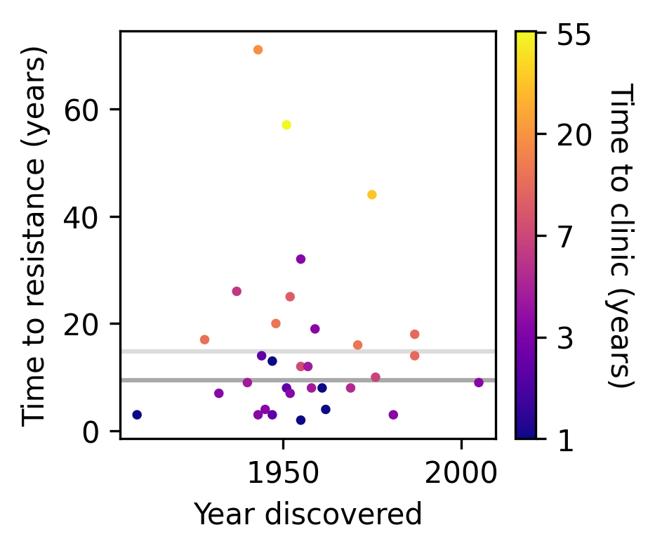
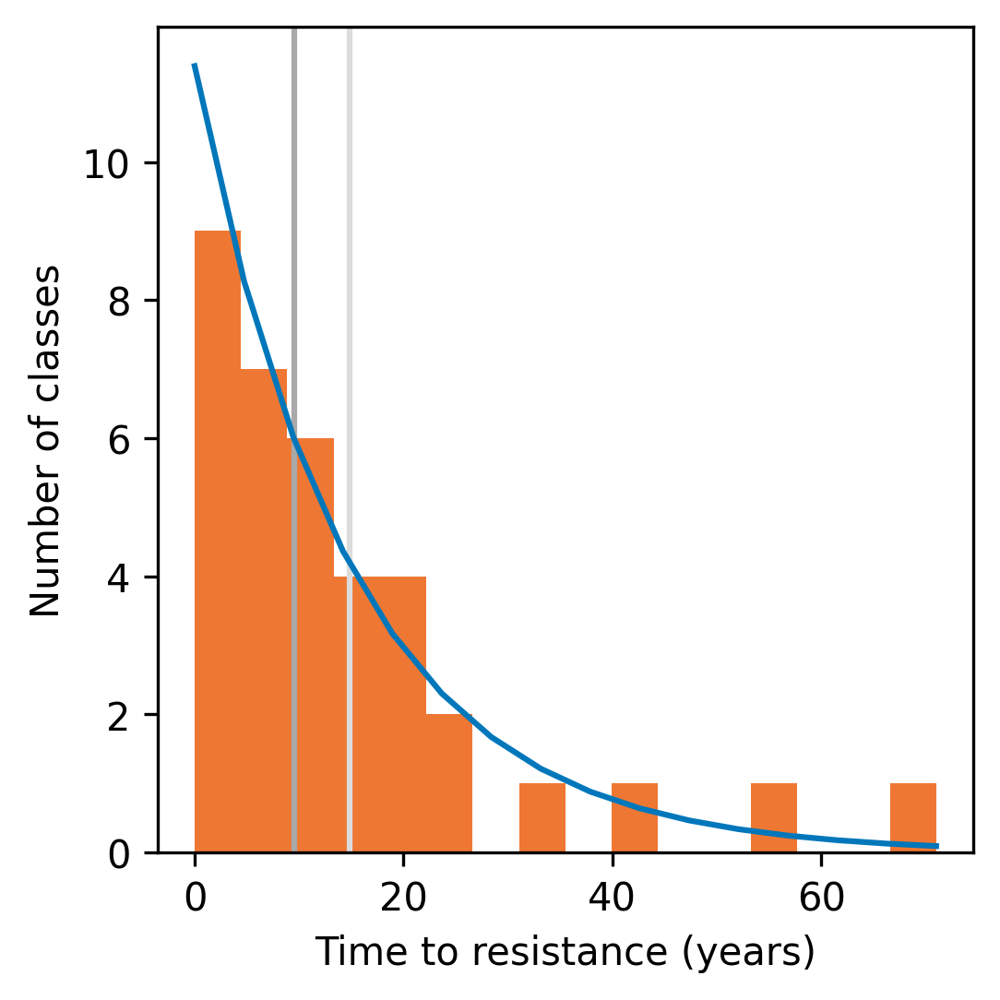
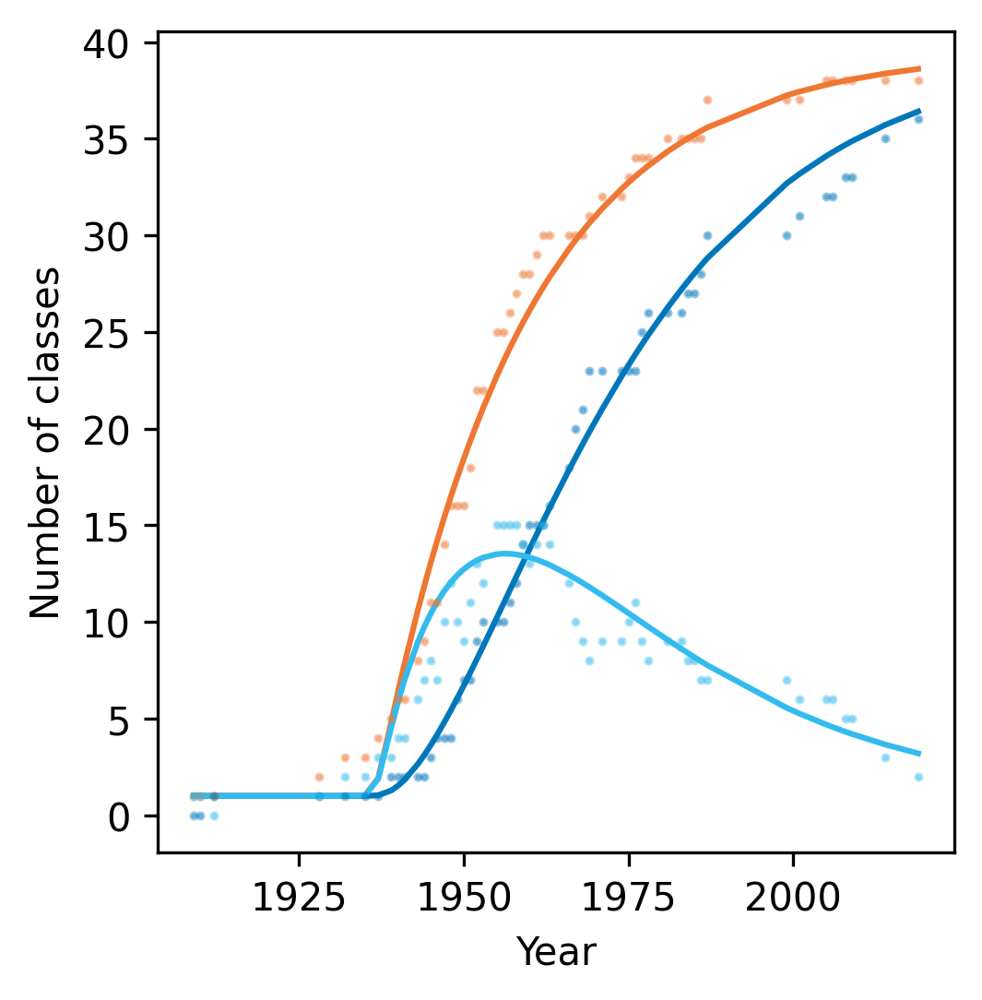

# Modelling the discovery of antibiotics

Jupyter notebook and data supporting Figure 1 from [Parkhill SL, Johnson EO, Integrating bacterial molecular genetics with chemical biology for renewed antibacterial drug discovery, _Biochemical Journal_ (2024) 481 (13): 839–864](https://doi.org/10.1042/BCJ20220062).

Access the notebook [here](https://github.com/scbirlab/2024-Parkhill-BiochemJ/blob/main/modelling-abx-discovery.ipynb). Run it interactively in Binder [here](https://mybinder.org/v2/gh/scbirlab/2024-Parkhill-BiochemJ/main?labpath=modelling-abx-discovery.ipynb).

**Figure 1.** The rate of antibacterial drug discovery has reached a plateau, while the rate of emergence of new resistance is constant.

**(A)** The time between discovery and resistance detection compared to the discovery year for classes of antibacterial drugs. Colour indicates the time between discovery and clinical use. Outliers in time to resistance (labelled with a canonical example in parentheses) are characterised by a longer gap between discovery and clinical use.

**(B)** The distribution of time between discovery and resistance for classes of antibacterial drugs follows an exponential distribution (Poisson maximum likelihood fit shown by blue line), with a half-life of ~15 years (95% confidence interval: 10–20 years).

**(C)** Poisson maximum likelihood best fits for the dynamics of antibacterial drug discovery. The number of classes with resistance not-yet-detected (light blue line) as a function of time was modelled as the difference between the number of discovered classes, $D$ (orange line), and the number of classes with detected resistance, $R$ (dark blue line). $R$ was modelled as exponential growth with rate $t_{1/2}$. $D$ was modelled as the coupon collector problem when sampling from $k$ antibacterial drug classes at a constant rate $n$ after a ~28 year lag phase, $t_{\text{lag}}$. Data were obtained from [Stennett, Back, and Race](https://doi.org/10.3390/antibiotics11091237).
